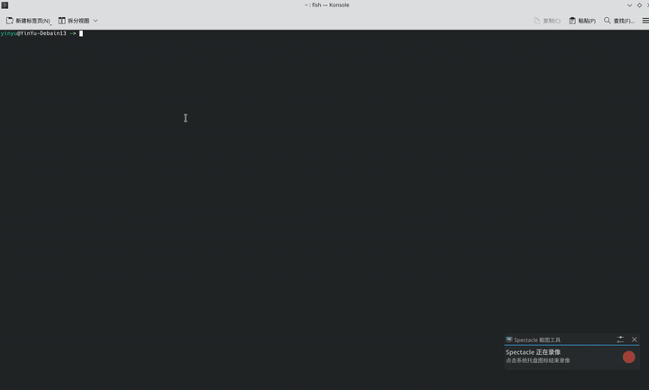

<div align="center">
<pre>
██╗     ██╗███╗   ███╗ █████╗  ██████╗
██║     ██║████╗ ████║██╔══██╗██╔════╝
██║     ██║██╔████╔██║███████║██║     
██║     ██║██║╚██╔╝██║██╔══██║██║     
███████╗██║██║ ╚═╝ ██║██║  ██║╚██████╗
╚══════╝╚═╝╚═╝     ╚═╝╚═╝  ╚═╝ ╚═════╝
</pre>

<p>跨平台开发环境，一处配置，处处同步</p>

<p>
  
  
  
  <a href="docs/OPERATIONS.md"></a>
</p>
</div>

---

<a id="features"></a>
## ✨ 特性

- **跨平台统一**：一套配置覆盖 Linux、macOS 与 WSL2。
- **声明式环境**：基于 Nix Flakes，环境可复现、可版本控制。
- **Home Manager**：集中管理 Shell、Git、工具链与 dotfiles。
- **自动 Host 生成**：运行一条脚本即可在 `~/.config/limac/host.nix` 生成属于你的本地配置。
- **分领域包管理**：AI、Python、Java、C++、嵌入式、容器、IDE 按需启用。
- **系统级 GUI 安装**：Ansible 一键安装 Docker、Chrome、VSCode、微信（仅 Linux）。
- **内置维护工具**：`nix fmt` 格式化、`bin/update-flake` 更新依赖。

---

<a id="verified-platforms"></a>
## ✅ 已验证平台

| 系统 | 状态 | 说明 |
|---|---|---|
| `x86_64-linux` | ✅ 已验证 | 主流 Linux 桌面/服务器 |
| `aarch64-darwin` | ✅ 已验证 | Apple Silicon Mac（M1/M2/M3） |
| `aarch64-linux` | ⏳ 未验证 | ARM Linux，理论上支持 |
| `x86_64-darwin` | ⏳ 未验证 | Intel Mac，理论上支持 |

> `aarch64-linux`和`x86_64-darwin`尚未实测，欢迎反馈

---

<a id="toc"></a>
## 📋 目录

- [✨ 特性](#features)
- [✅ 已验证平台](#verified-platforms)
- [🎬 效果预览](#preview)
- [🚀 快速开始](#quick-start)
- [🛠️ 系统级安装（可选，仅 Linux）](#system-install)
- [🔄 日常维护](#daily-ops)
- [❓ 常见问题速查](#faq)
- [📖 更多参考](#more-docs)
- [📜 许可证与反馈](#license)

---

<a id="preview"></a>
## 🎬 效果预览

<p align="center">
  
</p>

---

<a id="quick-start"></a>
## 🚀 快速开始

> **预计时间**：3 分钟  
> **前置条件**：已安装 `git`，终端可以访问外部网络（Nix 官方缓存），并且当前用户具有 `sudo` 权限。

### 第一步：安装 Nix

#### Linux (Debian / Ubuntu)

1. 安装 Nix 包：
    ```sh
    sudo apt install nix
    ```

2. 编辑 `/etc/nix/nix.conf`，写入基础配置（**将 `your_username` 替换为你的实际用户名**，可通过 `whoami` 查看）：
    ```ini
    sandbox = true
    experimental-features = nix-command flakes
    trusted-users = root your_username
    build-users-group = nixbld
    ```

3. 将当前用户加入 `nix-users` 组，然后**重启电脑**使组变更生效：
    ```sh
    sudo usermod -aG nix-users $(whoami)
    ```

    > 重启后可通过 `id` 命令确认输出中包含 `nix-users`。若临时想在不重启的情况下继续，可在当前终端执行 `newgrp nix-users`。

#### macOS (Apple Silicon)

```sh
curl -L https://nixos.org/nix/install | sh -s -- --daemon
```

> 若遇网络问题或需要设置代理，请参阅 [高级 Nix 安装与配置指导](docs/OPERATIONS.md#2-高级-nix-安装与配置指导)。

### 第二步：配置初始化与应用

在克隆好的本仓库根目录下直接运行：

```sh
bin/home-manager-setup
```

脚本会交互式完成：

1. **检查依赖**：确认 Nix、Git 与 Nix daemon 可访问。
2. **开启 Flakes**：自动配置 `~/.config/nix/nix.conf`。
3. **生成本地专属配置文件**：根据当前系统用户名和平台，在 `~/.config/limac/host.nix` 创建配置。
4. **使用 `--impure` 应用**：脚本会带 `--impure` 运行 home-manager，使 flake 能够读取仓库外的本地配置。
5. **直接应用**：一键应用所有用户包与环境配置。

### 第三步：更换默认 Shell

要享受所有 Nix 软件与 Fish 别名，需将终端 Shell 切换为 Home Manager 管理的 Fish：

- **Fish 路径**：
  - Linux: `/home/<username>/.nix-profile/bin/fish`
  - macOS: `/Users/<username>/.nix-profile/bin/fish`

- **WSL2 推荐做法**：直接将其设为登录 Shell：
  ```sh
  sudo sh -c "echo $(realpath ~/.nix-profile/bin/fish) >> /etc/shells"
  chsh -s ~/.nix-profile/bin/fish
  ```
  退出后执行 `wsl --shutdown`，重新进入 WSL 即可生效。

> 具体终端如 Konsole、iTerm2 或 VS Code 终端的切换步骤，请参考 [终端 Shell 设置指导](docs/OPERATIONS.md#3-终端-shell-设置指导)。

---

<a id="system-install"></a>
## 🛠️ 系统级安装（可选，仅 Linux）

安装系统级 GUI 工具（Docker、Chrome、VSCode、微信），直接运行：

```sh
bin/install-via-ansible
```

---

<a id="daily-ops"></a>
## 🔄 日常维护

| 目的 | 命令 | 说明 |
|---|---|---|
| **格式化配置** | `nix fmt` | 格式化所有 Nix 文件 |
| **升级所有依赖** | `bin/update-flake` | 更新 `flake.lock` 并创建备份 |
| **Linux 应用更新** | `nix run "nixpkgs#home-manager" -- switch --flake .#<system> --impure` | 修改配置后重新应用，如 `#x86_64-linux` |
| **macOS 应用更新** | `nix run "nixpkgs#home-manager" -- switch --flake .#<system> --impure` | 修改配置后重新应用，如 `#aarch64-darwin` |
| **检查 Flake 结构** | `nix flake check --no-build` | 验证配置语法与结构 |
| **查看所有配置名** | `nix flake show` | 列出 flake 提供的所有 outputs |
| **查看 Home Manager 新闻** | `home-manager news` | 查看更新日志与提示 |

---

<a id="faq"></a>
## ❓ 常见问题速查

| 问题 | 快速解决 | 详情 |
|---|---|---|
| Nix 提示找不到本地 host 文件 | 确认 `~/.config/limac/host.nix` 存在，且命令带 `--impure` | [OPERATIONS.md §11.1](docs/OPERATIONS.md#111-nix-提示找不到本地-host-文件) |
| `nix fmt` 报错 `does not provide attribute 'formatter...'` | 确认 `flake.nix` 的 `systems` 包含当前架构 | [OPERATIONS.md §11.2](docs/OPERATIONS.md#112-运行-nix-fmt-报错-does-not-provide-attribute-formatter) |
| Docker 安装后仍需要 `sudo` | `newgrp docker` 或重新登录 | [OPERATIONS.md §11.3](docs/OPERATIONS.md#113-docker-安装后仍需要-sudo) |
| 微信安装后缺少依赖 | `sudo apt --fix-broken install` | [OPERATIONS.md §11.4](docs/OPERATIONS.md#114-微信安装后缺少依赖) |

---

<a id="more-docs"></a>
## 📖 更多参考

- 项目结构、高级定制、如何新增软件包或用户：➡️ [操作手册 (docs/OPERATIONS.md)](docs/OPERATIONS.md)

---

<a id="license"></a>
## 📜 许可证与反馈

本项目暂未指定开源许可证。

如有问题、建议或发现 bug，欢迎通过仓库 issue 反馈。
